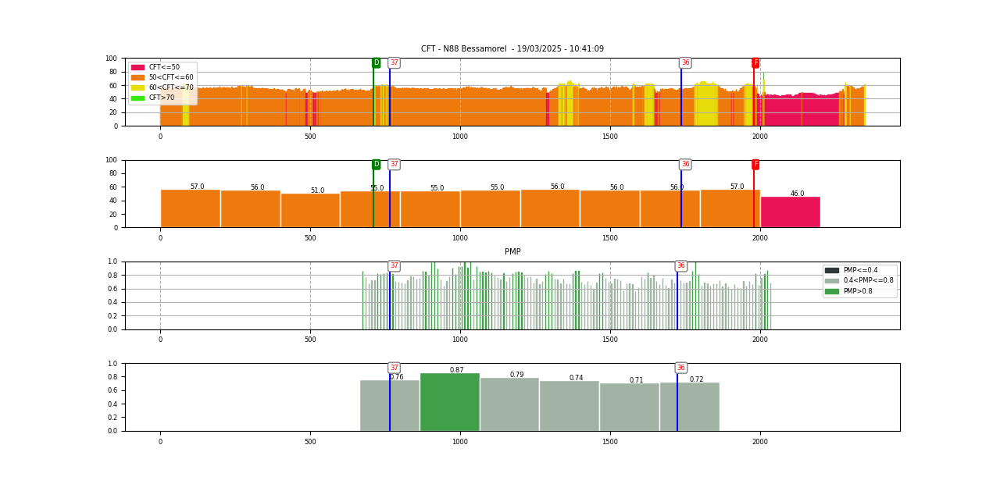

# exploitation de données routières

traitement de fichiers de mesure routière

## installation sous windows :

- installer python stable : https://www.python.org/downloads/windows/
- installer vscode : https://code.visualstudio.com/

```
py -m pip install matplotlib
py -m pip install inquirer
py -m pip install folium
py -m pip install geopandas
```

## organisation des répertoires de données

exemple de structure pour le dossier `datas` à implanter dans le répertoire `src`

```
├───datas
│   ├───CD43
│   │   ├───pôle Craponne sur Arzon
│   │   │       RD906 VOIE DROITE PR20 a 23+446.csv
│   │   │       RD906 VOIE GAUCHE PR23+446 a 20.csv
│   │   └───pôle Le Puy en Velay
│   │           RD136 VOIE DROITE PR0 a 4+153.csv
│   │           RD136 VOIE GAUCHE PR4+153 a 0.csv
│   │           RD902 N1 voie droite PR3+072 a 11+186.csv
│   │           RD902 N1 voie gauche PR11+186 a 3+072.csv
│   │           RD902 N2 voie droite PR11+865 a 17+.csv
│   │           RD902 N2 voie gauche PR17+030 a 11+865.csv
│   └───DIRMC
│       └───Bessamorel
│           │   N88 Bessamorel VL AXE.csv
│           │   N88 Bessamorel VL TRACE DROITE.csv
│           └───RUGO
│               ├───APO0122030190.SES
│               │       APO0122030190.EV0
│               │       APO0122030190.ID0
│               │       APO220105.CFG
│               │       APORUG0121030190.ME0
│               │       APORUG0121030190.RE0
│               └───APO0122030200.SES
│                       APO0122030200.EV0
│                       APO0122030200.ID0
│                       APO220105.CFG
│                       APORUG0121030200.ME0
│                       APORUG0121030200.RE0
```

Dans cette structure de données exemple, on a :
- 2 clients : CD43 et DIRMC
- 2 types de mesures différentes: griptester MK2 (format csv) et rugolaser (format APO)

## utilisation

Pour faire un schéma itinéraire à partir de 2 sessions de mesure :

```
py .\src\griptester_v1.py --multi=2
```
On est ensuite invité à choisir les fichiers de mesure un par un.

Pour recaler les données une fois qu'on a bien en tête le PR sur lequel on veut effectuer le recalage :

```
py .\src\griptester_v1.py --multi=2 --pr=20
```



Les scripts peuvent aussi :
- transcoder les données du griptester au format geojson, pour les utiliser dans un SIG comme QGIS
- recompiler un fichier csv des données indexées au format PR+abscisse, moyennant une identification manuelle dans les geojson des PR depuis un référentiel connu (exemple BPTOPO)
