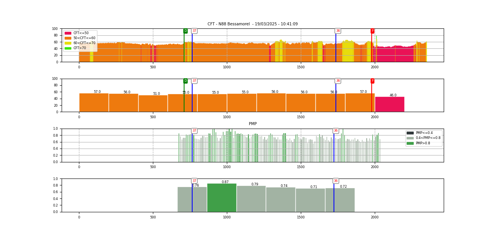
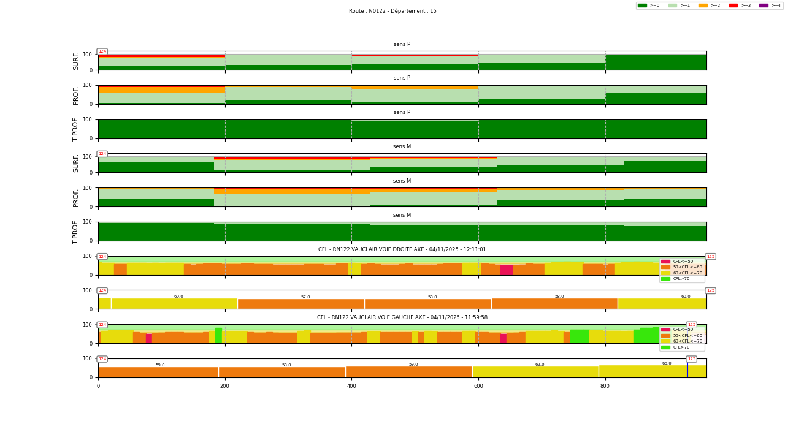

# exploitation de données routières

traitement de fichiers de mesure routière

## installation sous windows :

- installer python stable : https://www.python.org/downloads/windows/
- installer vscode : https://code.visualstudio.com/
- installer github desktop si on ne souhaite pas utiliser git en ligne de commande : https://desktop.github.com/download/

```
py -m pip install matplotlib
py -m pip install inquirer
py -m pip install folium
py -m pip install geopandas
py -m pip install pyyaml
```

## organisation des répertoires de données

exemple de structure pour le dossier `datas` à implanter dans le répertoire `src`

```
├───datas
│   ├───CD43
│   │   ├───pôle Craponne sur Arzon
│   │   │       RD906 VOIE DROITE PR20 a 23+446.csv
│   │   │       RD906 VOIE GAUCHE PR23+446 a 20.csv
│   │   └───pôle Le Puy en Velay
│   │           RD136 VOIE DROITE PR0 a 4+153.csv
│   │           RD136 VOIE GAUCHE PR4+153 a 0.csv
│   │           RD902 N1 voie droite PR3+072 a 11+186.csv
│   │           RD902 N1 voie gauche PR11+186 a 3+072.csv
│   │           RD902 N2 voie droite PR11+865 a 17+.csv
│   │           RD902 N2 voie gauche PR17+030 a 11+865.csv
│   └───DIRMC
│       └───Bessamorel
│           │   N88 Bessamorel VL AXE.csv
│           │   N88 Bessamorel VL TRACE DROITE.csv
│           └───RUGO
│               ├───APO0122030190.SES
│               │       APO0122030190.EV0
│               │       APO0122030190.ID0
│               │       APO220105.CFG
│               │       APORUG0121030190.ME0
│               │       APORUG0121030190.RE0
│               └───APO0122030200.SES
│                       APO0122030200.EV0
│                       APO0122030200.ID0
│                       APO220105.CFG
│                       APORUG0121030200.ME0
│                       APORUG0121030200.RE0
```

Dans cette structure de données exemple, on a :
- 2 clients : CD43 et DIRMC
- 2 types de mesures différentes: griptester MK2 (format csv) et rugolaser (format APO)

## utilisation

Pour faire un schéma itinéraire à partir de 2 sessions de mesure :

```
py .\src\generate_si.py --multi=2
```
On est ensuite invité à choisir les fichiers de mesure un par un.

Pour recaler les données une fois qu'on a bien en tête le PR sur lequel on veut effectuer le recalage :

```
py .\src\generate_si.py --multi=2 --pr=20
```



Les scripts peuvent aussi :
- transcoder les données du griptester au format geojson, pour les utiliser dans un SIG comme QGIS
- recompiler un fichier csv des données indexées au format PR+abscisse, moyennant une identification manuelle dans les geojson des PR depuis un référentiel connu (exemple BPTOPO)

## AIGLE3D

Le script peut intégrer les **états de surface AIGLE3D** (IES / IEP / IETP) si le fichier Excel et les paramètres sont renseignés dans [configuration.yml](src/configuration.yml).

Pour activer AIGLE3D, renseigner par exemple :

```yaml
aigle_xls: "Aigle3D/Table_Indicateurs_Etat_surface_DIRMC.xlsx"
aigle_route: "N0122"
aigle_dep: "15"
aigle_sens:
  - P
  - M
```
Si `aigle_route` ou `aigle_dep` est vide, les données AIGLE3D ne seront pas chargées en mémoire.

## Exemple Intégration grip + A3D




## Configuration.yml

Le fichier configuration.yml permet d’ajuster le comportement des scripts sans modifier le code.

Exemple de paramètres utiles :

## Pas pour le calcul des moyennes (en m)

```yaml
# si on ne précise rien, la valeur est 200
mean_step:
```

## Sous-répertoire de datas utilisé comme racine

```yaml
# si on ne précise rien, la valeur est datas
# si on précise sub1/sub2, la valeur est datas/sub1/sub2 
datas:
```

## Affichage des légendes
1 = oui, 0 = non
```yaml
legend: 1
```

## Emplacement d'un fichier contenant des données en PR+abcisse 

le fichier csv doit être dans le répertoire `datas`

```yaml
# emplacement d'un fichier contenant des données en PR+abcisse dans datas
pr_abs_csv: "PR_ABS/exp_N0122_Vauclair.csv"
```

## Inversion automatique des séries monomesure si besoin

```yaml
# exemple de use case : seulement des données de sens gauche sont à traiter
# en mettant 1, elles seront automatiquement retournées dans le sens plus
# et la synchro avec aigle se fera bien.
force_reverse: 1
```

## Transparence des bandes de couleur en fond des graphiques griptester

mettre tous ces paramétres à 0 pour revenir au fond blanc
```yaml
background_alpha:
  - poor: 0.1
  - fine: 0.3
  - good: 0.4
  - excellent: 0.4
```
